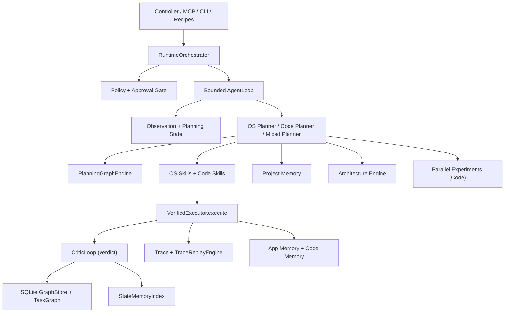

# Oracle OS


**A safe, local macOS operator runtime with a shared dual-agent substrate.**

[](LICENSE)

[](https://swift.org)


[Quick Start](#-quick-start) · [Features](#-features) · [Architecture](#-architecture) · [MCP Tools](#-mcp-tool-surface) · [Docs](docs/README.md) · [Contributing](CONTRIBUTING.md)

---

Oracle OS runs two agents on a single execution core — one controls your Mac, the other writes your code — sharing a unified trust boundary, policy engine, and verified execution path.

| | |
| :---: | :---: |
|  |  |
| *macOS operator agent in action* | *Replayable recipe execution* |

## 📖 Table of Contents

- [Quick Start](#-quick-start)
- [Features](#-features)
- [Architecture](#-architecture)
- [Safety Model](#-safety-model)
- [MCP Tool Surface](#-mcp-tool-surface)
- [Oracle Controller](#-oracle-controller)
- [How It Works](#how-it-works)
- [Repository Layout](#-repository-layout)
- [Development](#-development)
- [Roadmap](#-roadmap)
- [Contributing](#-contributing)
- [License](#-license)

## 🚀 Quick Start

```bash
# Clone and build
git clone https://github.com/dawsonblock/Oracle-OS.git
cd Oracle-OS
swift build

# First-time setup
./.build/debug/oracle setup
./.build/debug/oracle doctor
```

Current highlights:

- 22 public MCP tools remain available under stable `oracle_*` names
- native local controller and bundled host process are working
- verified execution is active for the core interaction actions
- canonical observation snapshots are real and used by runtime logic
- planning-state abstraction is implemented and used as reusable graph state
- graph persistence is SQLite-backed
- policy and approval gating are active runtime concerns, not just scaffolding
- code-domain execution uses a workspace-scoped runner instead of unsafe shell UI control
- project memory, experiment fanout, and architecture review are implemented as bounded upper layers
- Reasoning Layer: Multi-coordinator architecture for decision, execution, learning, and recovery

> **Requirements:** macOS 14+, Swift 6.0+, Accessibility and Screen Recording permissions.

## ✨ Features

### 🖥️ macOS Operator Agent

Control apps, browsers, windows, and files through safe, verified action paths.

- **AX-first perception** — inspect UI state, capture screenshots and element context
- **Verified interactions** — click, type, press, focus, scroll, and window-manage with pre/post observation checks
- **Replayable recipes** — automate multi-step workflows as portable JSON
- **Policy & approval gating** — risky actions require explicit approval before execution

### 💻 Software Engineer Agent

Read code, edit files, run builds and tests — all scoped to your workspace.

- **Repository intelligence** — index structure, symbols, dependencies, and tests
- **Workspace-scoped execution** — file edits, builds, tests, and git ops without unsafe shell automation
- **Bounded experiments** — fan out candidate fixes in isolated git worktrees, ranked and replayed
- **Project memory** — retrieve prior design decisions and avoid already-failed approaches

### 🔗 Shared Substrate

Both agents share one runtime, one policy engine, one verified execution boundary, one trace system, one graph store, and one memory layer.

## 🏗 Architecture



### Execution spine

All runtime effects now flow through a single command spine:

> **Intent -> RuntimeOrchestrator.submitIntent -> Planner -> Command -> VerifiedExecutor -> CommandRouter -> DomainRouter -> Execution -> Events -> CommitCoordinator**

Every action flows through:

> **Observe → Abstract → Plan → Gate → Execute → Trace → Learn**

This makes the system slower to overclaim and harder to poison with weak evidence. For full details see [ARCHITECTURE.md](ARCHITECTURE.md).

### Core runtime layers

#### Observation & Planning State

`ObservationBuilder` and `ObservationFusion` produce canonical observations. `StateAbstraction` reduces them into reusable planning state — preventing DOM drift from exploding state cardinality and giving graph edges stable node identity.

#### Verified Execution

`VerifiedExecutor.execute(_:)` is the core trust boundary. Each step performs policy validation, routed command execution, postcondition verification, and emits execution events consumed by `CommitCoordinator`.

#### Graph Learning

Transitions are recorded into a SQLite-backed graph with tiered knowledge: `exploration` → `candidate` → `stable`. Experiment and recovery evidence cannot promote directly to stable — only trusted, replayed outcomes earn that tier.

#### Dual-Agent Runtime

OS-domain planning (graph-backed UI interaction, ranked targets, verified execution) and code-domain planning (repo indexing, patch/build/test loops, workspace-scoped execution) hand off seamlessly in one bounded loop.

## 🛡 Safety Model

Oracle OS is intentionally conservative. Ambiguous policy states fail closed.

| | Examples |
| --- | --- |
| ✅ **Allowed** | Observation, inspection, safe navigation, workspace reads, local build/test/lint, safe git (`status`, `diff`, `branch`, `commit`) |
| 🔐 **Approval-gated** | Send/submit flows, purchase interactions, destructive file ops, `git push`, sensitive config changes |
| 🚫 **Blocked** | Terminal/shell UI control, arbitrary shell strings, writes outside workspace, force push, system file mutation |

### Governance contract

- One hard execution truth path
- Reusable knowledge separated from episode residue
- Hierarchical planning with local execution
- Recovery treated as a first-class mode
- Architecture growth gated by eval and governance coverage

See [docs/GOVERNANCE.md](docs/GOVERNANCE.md) for the full normative contract.

## 🔌 MCP Tool Surface

Oracle OS exposes **22 stable public MCP tools** under `oracle_*` names:

| Category | Tools |
| --- | --- |
| **Perception** | `oracle_context` · `oracle_state` · `oracle_find` · `oracle_read` · `oracle_inspect` · `oracle_element_at` · `oracle_screenshot` |
| **Actions** | `oracle_click` · `oracle_type` · `oracle_press` · `oracle_hotkey` · `oracle_scroll` · `oracle_focus` · `oracle_window` |
| **Vision** | `oracle_ground` · `oracle_parse_screen` |
| **Diagnostics** | `oracle_wait` · `oracle_permissions` · `oracle_doctor` |
| **Recipes** | `oracle_recipes` · `oracle_run` · `oracle_recipe_show` · `oracle_recipe_save` · `oracle_recipe_delete` |

## 🎛 Oracle Controller

A native local macOS controller for supervised operation.

```bash
# From source
swift build && open OracleController.xcworkspace

# Packaged app
./scripts/build-controller-app.sh --configuration release
./scripts/create-controller-dmg.sh --configuration release
```

The controller surfaces operator controls, recipe execution, trace inspection, policy approvals, experiment metadata, project-memory references, and architecture findings. First launch guides you through Accessibility, Screen Recording, and optional vision setup.

More details: [docs/oracle-controller.md](docs/oracle-controller.md)

## How It Works

### macOS task execution

1. Observe the frontmost app and UI state
2. Abstract the state into reusable planning state
3. Query graph-backed or exploration-backed planner
4. Resolve targets through ranking
5. Gate the action through policy
6. Execute through verified execution
7. Classify success / failure
8. Record trace and update graph / memory

### Code task execution

1. Classify the goal as code-domain or mixed
2. Index the current workspace
3. Retrieve relevant project-memory records
4. Run architecture review if the change looks high-impact
5. Choose a direct step or escalate to bounded experiments
6. Execute through the workspace-scoped runner
7. Replay the selected winner through the primary runtime path
8. Record trace, graph, and memory updates

### Project memory

Engineering memory — not chat memory. Canonical Markdown in [`ProjectMemory/`](ProjectMemory) covering architecture decisions, open problems, rejected approaches, known-good patterns, risks, and roadmap state. The runtime writes draft records only; promotion to accepted memory is deliberate.

### Parallel experiments

Code tasks fan out into bounded candidate experiments (default: 3) using git worktrees. Candidates are ranked by: passing build/tests → fewer touched files → smaller diff → lower architecture risk → lower latency. Only the selected candidate, replayed in the primary workspace, can become stable graph knowledge.

## 📁 Repository Layout

```text
AppResources/                   controller assets, entitlements, and release notes
docs/                           status, governance, rollout, and architecture docs
ProjectMemory/                  canonical project memory records
recipes/                        replayable JSON workflow recipes
scripts/                        build, packaging, and release helpers
Sources/
  OracleOS/                     runtime, planning, tools, memory, and execution core
  OracleController/             native local controller UI
  OracleControllerHost/         bundled host process for the controller
  OracleControllerShared/       shared controller models and protocols
  oracle/                       CLI entrypoints and setup tooling
Tests/                          controller tests, runtime tests, evals, and fixtures
vision-sidecar/                 optional Python vision service
web/                            frontend assets and Vite app
```

See [docs/README.md](docs/README.md) for a guided documentation index.

## 🔧 Development

```bash
swift build                    # build the project
swift test                     # run tests
open OracleController.xcworkspace   # open controller in Xcode

# CLI commands
./.build/debug/oracle setup    # first-time setup
./.build/debug/oracle doctor   # check system health
./.build/debug/oracle status   # runtime status
./.build/debug/oracle version  # version info

# Packaged app (unsigned debug build)
./scripts/build-controller-app.sh --configuration debug --skip-sign
./scripts/create-controller-dmg.sh --configuration debug --skip-sign
```

## 🗺 Roadmap

Oracle OS is on the path from **safe local operator + bounded coding agent** toward a **project-carrying engineering runtime**.

| Status | Area |
| :---: | --- |
| ✅ | Verified execution with pre/post observation |
| ✅ | Planning-state abstraction over raw observations |
| ✅ | SQLite-backed graph learning with trust tiers |
| ✅ | Bounded graph-aware runtime loop |
| ✅ | Native local controller with onboarding |
| ✅ | Project memory, parallel experiments, architecture engine |
| 🔄 | Vision as dominant fused perception path |
| 🔄 | Project-memory promotion workflows |
| 🔄 | Architecture governance beyond advisory |
| 🔜 | Long-horizon project execution with eval-backed gating |
| 🔜 | Workflow synthesis and promotion from traces |
| 🔜 | Belief-state reasoning and learned policies |

See [docs/STATUS.md](docs/STATUS.md), [docs/ARCHITECTURE_STATUS.md](docs/ARCHITECTURE_STATUS.md), and [docs/progress.md](docs/progress.md) for detailed tracking.

## 🤝 Contributing

Contributions are welcome! The easiest way to contribute is by submitting **recipes** — portable JSON workflows that automate real macOS tasks. See [CONTRIBUTING.md](CONTRIBUTING.md) for guidelines.

## 📄 License

[MIT](LICENSE) © 2026 Oraclewright
